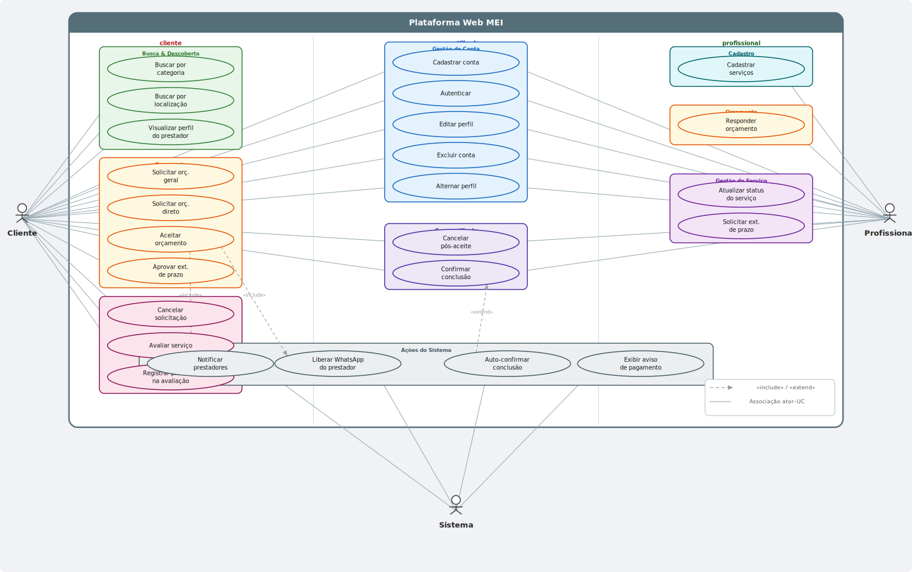

# ContrataAí

[](https://angular.io/)
[](https://nodejs.org/)
[](https://expressjs.com/)
[](https://www.mongodb.com/)
[]()

> **Projeto de Extensão II** – Plataforma web para conectar clientes e prestadores de serviços (MEI), com foco em orçamentos, gestão de serviços e reputação – **sem intermediação financeira**.

---

## 👥 Equipe

- Juno Piazza Lopes
- Efraim Nascimento

---

## 📋 Sobre o Projeto

Esta plataforma permite que usuários atuem tanto como **clientes** (contratantes) quanto como **prestadores** (profissionais), na mesma conta. Clientes podem buscar profissionais por categoria ou localização (cidade/CEP), solicitar orçamentos (abertos ou diretos), comparar propostas e, após aceite, contatar o prestador via WhatsApp. Prestadores gerenciam seus serviços, prazos, status e avaliações. Todo o fluxo de pagamento é externo à plataforma.

> A documentação completa de requisitos funcionais, não funcionais, regras de negócio e casos de uso está disponível em [`/docs`](./docs).

**Escopo do MVP** (2 meses):
- Funcionalidades essenciais de cadastro, busca, orçamento, aceite e avaliação (RF01–RF22, RF25).
- Status do serviço incluso (`Aguardando início → Em andamento → Aguardando confirmação → Concluído`).
- Campos fixos para solicitação — sem campos dinâmicos por categoria.
- Busca por localização via cidade/CEP — sem geolocalização por GPS.
- Notificações por e-mail no lugar de notificações em tempo real.

---

## 🚀 Tecnologias Utilizadas

| Camada | Tecnologia                             |
|---|----------------------------------------|
| Frontend | Angular 21+                            |
| Backend API | Node.js + Express                      |
| Banco de Dados | MongoDB                                |
| Autenticação | JWT + Bcrypt                           |
| Geolocalização | Geocodificação manual via CEP          |
| Conformidade | LGPD (anonimização, exclusão de dados) |

---

## 🧱 Arquitetura

Arquitetura **monolítica com separação lógica em camadas**: o frontend _Angular_ consome uma _API REST_ construída com _Node.js/Express_. Durante o desenvolvimento, rodam em portas separadas (frontend: `4200`, backend: `3000`).



---

## ✅ Funcionalidades do MVP

### 🔐 Gestão de Conta
- Cadastro único com perfis **Cliente** e **Prestador** na mesma conta (RF01)
- Login/logout seguro com JWT (`RF02`)
- Edição e exclusão de perfil (`RF03`, `RF04`)
- Alternância entre perfis sem logout (`RF05`)

### 🔍 Busca e Descoberta
- Busca de prestadores por **categoria** de serviço (`RF06`)
- Busca por **localização** via cidade ou CEP (`RF07`)
- Visualização de perfil do prestador com serviços, avaliações, valores e prazo médio (`RF08`)

### 📝 Orçamento
- Solicitação de orçamento **geral** para vários prestadores de uma categoria (`RF09`)
- Solicitação de orçamento **direto** a um prestador específico (`RF10`)
- Resposta de prestadores com valor e prazo (padrão: 15 dias) (`RF11`)
- Aceite de **apenas um** orçamento por solicitação, encerrando-a para os demais (`RF12`)
- Aviso de **pagamento externo** com confirmação de ciência obrigatória (`RF13`)
- Notificação por e-mail aos demais prestadores após aceite (`RF14`)
- Liberação do **WhatsApp do prestador** somente após aceite formal (`RF15`)

### ⚙️ Gestão do Serviço
- Prestador cadastra seus serviços com categoria, descrição e faixa de preço (`RF25`)
- Atualização de status do serviço pelo prestador (`RF18`)
- Cancelamento de solicitação antes do aceite ou em caso de atraso (`RF16`)
- Confirmação manual de conclusão por qualquer das partes (`RF19`)
- Avaliação com nota e comentário, liberada somente após conclusão (`RF22`, `RF23`)

## 🔮 Planejado para pós-MVP

Funcionalidades identificadas nos requisitos e deliberadamente adiadas por restrição de prazo:

- Busca por geolocalização real via GPS (`RNF01`)
- Campos dinâmicos por categoria de serviço
- Cancelamento pós-aceite com impacto reputacional (`RF17`)
- Extensão de prazo com aprovação do cliente (`RF21`)
- Confirmação automática de conclusão após 7 dias (`RF20`)
- Registro de problemas na avaliação (`RF24`)
- Notificações em tempo real (_WebSocket_)

---

## 📊 Diagramas

### Casos de Uso



---

## 🛠️ Como Executar (Desenvolvimento)

> Pré-requisitos: Node.js 24+, MongoDB 6+ (local ou Atlas), Angular CLI.

```bash
# Clone o repositório
git clone https://github.com/seu-usuario/plataforma-prestadores.git

# Backend
cd api
npm install
cp .env.example .env   # preencha as variáveis de ambiente
npm run dev

# Frontend
cd web
npm install
ng serve
```

As variáveis de ambiente necessárias estão documentadas em [`api/.env.example`](./api/.env.example).

---

## 📌 Requisitos Não Funcionais Atendidos no MVP

- 🔒 Senhas criptografadas com BCrypt (`RNF08`)
- 🗺️ Busca por localização via CEP/cidade (`RNF01`)
- ⚡ Buscas em até 3 segundos (`RNF07`)
- 📱 Interface responsiva e compatível com navegadores modernos (`RNF11`)
- 🔐 Conformidade com LGPD (`RNF09`)
- 🧱 Arquitetura preparada para expansão mobile (`RNF12`)
- 📊 Disponibilidade mínima de 95% (`RNF10`)

---

> ⚠️ **Aviso:** A plataforma não intermedia pagamentos. Todo acerto financeiro é de exclusiva responsabilidade entre cliente e prestador (RN01).